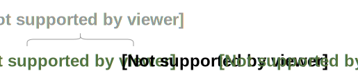

Le HTML (_HyperText Markup Language_) n'est pas un langage de programmation,
mais un langage de "marquage" (_markup_ en anglais) ou bien de "balises"
(_tags_ en anglais). Il permet de structurer le contenu d'une page Web selon
un format déterminé par le concepteur et réalisé par le programmeur Web.

Les versions du langage HTML
----------------------------

Durant ses années d'existence, le standard HTML a connu diverses évolutions.
La première version proposée en 1991 comportait 18 éléments. Différentes
versions du standard HTML sont publiées, jusqu'à la version **HTML 4.01** en
1999.

S'en suit une période de stagnation, durant laquelle le groupe de travail HTML
du **W3C** (World Wide Web Consortium) focalise ses efforts sur un nouveau
langage, le **XHTML**, qui s'avère une impasse.

En 2004, un groupe de travail concurrent se forme, nommé **WHATWG** (Web
Hypertext Application Technology Working Group), rassemblant des représentants
de Apple, Mozilla et Opera. Ce groupe élaborait le standard **HTML5** entre
2004-2007. En janvier 2008, la première spécification a été publiée. Cette
spécification a été adoptée comme référence par le groupe de travail HTML du
W3C. Ce n'est qu'en 2014 que le HTML5 est devenu une recommandation stable du
W3C. En fin 2017, le W3C a rendu officielle la version **HTML 5.2**. La version
suivante **HTML 5.3** est en cours d'élaboration.

<figure>
  
  <figcaption>L'évolution des standards HTML et CSS entre 1995 et 2015. Par <cite><a href="https://cours-web.ch/" target="_blank">cours-web.ch</a></cite></figcaption>
</figure>

Les éléments HTML
-----------------

Le vocabulaire du langage HTML se compose de plus qu'une centaine de balises
qu'on assemble autour des différentes parties du contenu pour lui fournir un
sens. Les balises qui entourent un mot ou le nom d'une image peuvent former un
lien hypertexte, mettre le texte en italique, etc. Par exemple, avec la ligne
de contenu suivante :

```html
J'aime le Web
```

Si vous souhaitez indiquer que ce texte fait partie d'un paragraphe, on le
placera dans un élément de paragraphe (`<p>`) :

```html
<p>J'aime le Web</p>
```

Si on veut qu'il soit un titre, on le met dans la balise `<h1>`.

```html
<h1>J'aime le Web</h1>
```

### Anatomie d'un élément HTML

Regardons de plus près cet élément paragraphe `<p>` :

<figure>
  
  <figcaption>Anatomie d'un élément HTML. Par <cite><a href="https://developer.mozilla.org/" target="_blank">Mozilla Developer Network</a></cite></figcaption>
</figure>

Les composants principaux de notre élément sont :

- **La balise ouvrante** : celle-ci se compose du nom de l'élément (ici "p"),
  entre deux chevrons. Cela indique le début de l'élément, où l'endroit à
  partir duquel celui-ci prend effet. Pour notre exemple, cela indique le début
  du paragraphe.
- **La balise fermante** : ici on a également des chevrons et le nom de
  l'élément, auxquels on ajoute une barre oblique avant le nom de l'élément.
  Cela indique la fin de l'élément. Pour notre exemple, cela indique la fin du
  paragraphe.
- **Le contenu** : C'est le contenu de l'élément, ici c'est simplement du
  texte.
- **L'élément** : Il est composé de la balise ouvrante, de la balise fermante
  et du contenu.

### Imbriquer des éléments

Vous pouvez placer des éléments au sein d'autres éléments, c'est ce qu'on
appelle l'imbrication. Par exemple, si vous souhaitez montrer que vous aimez
beaucoup le web, vous pouvez placer le mot « beaucoup » dans un élément
`<strong>`, ce qui signifie que le mot sera mis en gras :

```html
<p>J'aime <strong>beaucoup</strong> le Web</p>
```

Ce qui résulte en :

<p>
  <iframe height='40' scrolling='no' src='demos/p-inside-strong.html'></iframe>
</p>

Toutefois il faut faire attention à ce que les éléments soient bien imbriqués
les uns dans les autres. Dans l'exemple précédent, on ouvre l'élément `<p>`,
puis l'élément `<strong>`. Plus loin, on ferme l'élément `<strong>` puis on
ferme l'élément `<p>`. Si on utilise le code suivant, ce sera incorrect :

```html
<p>J'aime <strong>beaucoup le Web</p></strong>
```

Même que les navigateurs implémentent différents algorithmes pour essayer de
fixer ces erreurs dans les documents HTML avant d'afficher le résultat, il faut
vérifier la structure du document parce que ces algorithmes ont des limites et
peuvent donner des résultats différents et inutilisables.

### Les balises orphelines

Ce sont des balises qui ont uniquement un indicateur de début. Comme la balise
:

```html

```

### Les attributs

Les éléments peuvent avoir des "attributs".

<figure>
  
  <figcaption>Les attributs d'une balise HTML</figcaption>
</figure>

Les attributs contiennent des informations supplémentaires qui portent sur
l'élément et qu'on ne souhaite pas afficher avec le contenu.

**Exemples** :
- Dans une balise `<a href ="http:...">Nom du lien </a>` l'attribut `href` a
  comme valeur "http:....".
- Dans la balise `` les trois
  attributs `src`, `width` et `height` sont des attributs de l'élément img.

Les attributs seront très utiles dans les chapitres suivants par exemple pour
définir le comportement de nos formulaires et pour les mises en forme de page
Web.

Un attribut doit toujours avoir :

- un **nom** (le nom de l'attribut) qui doit être séparé par un espace du nom
  de la balise ou de l'attribut précédent (s'il y a des multiples attributs).
- une **valeur** encadrée par des guillemets (") et séparés par un signe égal
  "=" du son nom (le nom de l'attribut).

L'attribut a alors la syntaxe suivante : `nom = "valeur"`

**Remarque** : Les guillemets peuvent être omises dans HTML5.

Les attributs booléens ne nécessitent pas une valeur, un exemple d'un attribut
booléen est l'attribut `checked` (coché) de l'élément case à cocher pour
spécifier que la case est cochée, cet attribut ne nécessite pas une valeur car
sa présence est interprétée comme la valeur vrai. Au contraire son absence est
interprété comme la valeur faux.

Les commentaires dans HTML sont délimités par `<!--` et `-->`. Par exemple :

```html
<!-- Un texte dans un commentaire -->
```

Les commentaires peuvent exister dans n'importe quelle partie du code HTML
mais pas dans une balise (entre les chevrons de la balise). Prenons l'exemple :

```html

```

Le résultat sera :

<p>
  <iframe height='80' scrolling='no' src='demos/commentaire.html'></iframe>
</p>

Le document HTML
----------------

Pour l'instant nous avons vu quelques éléments HTML de base. Pris séparément,
ils ne sont pas très utiles. Regardons comment les combiner pour créer une page
HTML complète. Nous allons repartir de l'exemple contenu dans le fichier
`index.html` :

```html
<!DOCTYPE html>
<html>
  <head>
    <meta charset="utf-8" />
    <title>Ma première page Web</title>
  </head>
  <body>
    <p>J'aime <strong>beaucoup</strong> le Web.</p>
  </body>
</html>
```

Cet exemple contient :

`<!DOCTYPE html>`
: le _doctype_. Au début de HTML, dans les années 1991-1992, les doctypes étaient
utilisés pour faire référence à des ensembles de règles qu'on pouvait utiliser
pour dire qu'un document était du HTML « valide » et détecter les erreurs de
balisage. Cependant, ceux-ci ne sont plus utilisés aujourd'hui et sont juste
présents pour s'assurer que la page puisse fonctionner y compris sur les
anciens navigateurs.

`<html></html>`
: l'élément `<html>`. Cet élément encadre tout le contenu de la page. Cet élément
est parfois appelé l'élément racine.

`<head></head>`
: l'élément `<head>`. Cet élément est utilisé comme un conteneur (_container_)
pour toutes les choses qui font partie de la page HTML mais qui ne sont pas du
contenu affiché.  C'est dans cet élément qu'on mettra des mots-clés, une
description de la page qui apparaîtra sur les moteurs de recherche, les liens
vers les fichiers CSS à utiliser pour la mise en forme, les déclarations des
jeux de caractères (_character sets_) à utiliser et ainsi de suite.

`<body></body>`
: l'élément `<body>`. Cet élément est celui qui contient tout le contenu que
vous souhaitez afficher pour qu'il soit vu par les visiteurs : cela peut être
du texte, des images, des vidéos, des fichiers sons, etc.

`<meta charset="utf-8" />`
: Cet élément définit le jeu de caractères qui devrait être utilisé pour le
document et indique que c'est utf-8. utf-8 regroupe l'ensemble des caractères
connus utilisés dans les différents langages humains. Généralement utf-8 permet
de gérer n'importe quel texte que vous pourriez utiliser sur la page. C'est
pour cette raison qu'on utilise ce jeu de caractères car il permet de couvrir
l'extrême majorité des cas.

`<title></title>`
: Cet élément définit le titre de votre page. C'est ce titre qui apparaîtra sur
l'onglet lorsque la page sera chargée. C'est également ce titre qui sera
utilisé pour décrire la page lorsque vous la placez dans vos marques-pages ou
pour gérer l'accessibilité au niveau des navigateurs.

Les balises principales
-----------------------

### Baliser le texte

Dans cette section, nous verrons quelques-uns des éléments de base de HTML pour
baliser le texte.

#### Les titres

Les éléments de titre permettent de définir certains textes comme des titres ou
sous-titres pour le contenu. D'une certaine façon, ceux-ci fonctionnent comme
pour un livre : on a le titre du livre (le plus important) puis les titres des
différents chapitres et parfois des sous-titres au sein de ces chapitres. HTML
contient des éléments pour 6 niveaux de titres : `<h1>`–`<h6>`. La plupart du
temps, 3-4 niveaux suffisent amplement :

```html

```

<p>
  <iframe height='220' scrolling='no' src='demos/balise-h1.html'></iframe>
</p>

Vous pouvez ajouter un titre adapté à votre page avec un de ces éléments.

#### Les paragraphes

Comme expliqué auparavant, les éléments `<p>` sont utilisés pour contenir des
paragraphes de texte. Vous les utiliserez fréquemment pour placer du texte sur
une page :

```html

```

<p>
  <iframe height='40' scrolling='no' src='demos/balise-p.html'></iframe>
</p>

Un élément `<p>` placé dans un autre élément de type `<p>` sera interprété
comme définit au dehors et le paragraphe externe est terminée avant l'ouverture
de la balise de l'élément `<p>` interne.

```html

```

<p>
  <iframe height='100' scrolling='no' src='demos/balise-p-inside.html'></iframe>
</p>

Un élément `<p>` élimine les espaces redondants et les retours à la ligne
suivante. Pour maintenir des espaces voulus ou bien un retour à la ligne, vous
pouvez utiliser la balise `<pre>` au lieu de `<p>`.

Exemple :

```html

```

<p>
  <iframe height='100' scrolling='no' src='demos/p-vs-pre.html'></iframe>
</p>

#### Les listes

Une grande partie du contenu sur le Web est présente sous forme de listes à
puces ou bien listes numérotées. HTML a donc des éléments utilisés pour
représenter ces listes. Le balisage des listes contient toujours au moins deux
éléments. Le type de liste et les lignes de listes (les _items_).  Les types de
listes utilisés fréquemment sont les listes ordonnées et les listes
non-ordonnées :

1. **Les listes non-ordonnées** sont des listes pour lesquelles l'ordre des
   éléments n'a pas d'importance (correspondent aux listes à puces). La balise
   utilisée pour ces listes est l'élément `<ul>` (**ul** signifie **u**nordered
   **l**ist qui signifie liste non-ordonnée en anglais)
2. **Les listes ordonnées** sont des listes pour lesquelles l'ordre des
   éléments est important c'est à dire les listes numérotées. La balise
   utilisée pour ces listes est l'élément `<ol>` (**ol** signifie **o**rdered
   **l**ist qui signifie liste ordonnée en anglais)

Chaque élément d'une liste est balisé avec un élément `<li>` (**l**ist
**i**tem).

Par exemple, si on souhaite modifier un paragraphe en une liste :

```html
<p>Mozilla est une communauté mondiale composée de technologues, penseurs,
constructeurs qui travaillent ensemble...</p>
```

On pourrait faire :

```html

```

<p>
  <iframe height='160' scrolling='no' src='demos/balise-ul.html'></iframe>
</p>

Une liste ordonnées est similaire :

```html

```

<p>
  <iframe height='80' scrolling='no' src='demos/balise-ol.html'></iframe>
</p>

Une liste peut être interne dans une liste. On peut aussi mélanger les listes
des différents types.

```html

```

<p>
  <iframe height='140' scrolling='no' src='demos/balise-ul-ol.html'></iframe>
</p>

#### Listes de descriptions

La liste des descriptions permettent de décrire un terme. Elle est délimitée
par la balise `<dl>` (**d**escription **l**ist). On utilise la balise `<dt>`
(**d**escription **t**erm) pour spécifier le terme à définir suivi par une
balise `<dd>` (**d**escription **d**escription) pour décrire le terme. On peut
spécifier des multiple de termes par description ou multiple description par
terme.

```html

```

Le résultat sera :

<p>
  <iframe height='130' scrolling='no' src='demos/description-list.html'></iframe>
</p>

### Les images

Pour afficher un image, on utilise la balise ``. Cet élément permet
d'intégrer une image dans la page, à l'endroit où l'élément apparaît. La source
de l'image utilisée est définie via l'attribut `src` (pour **s**ou**rc**e) qui
contient le chemin vers le fichier de l'image.

```html

```

<p>
  <iframe height='440' scrolling='no' src='demos/balise-img.html'></iframe>
</p>

Nous avons aussi utilisé l'attribut `alt` (pour **alt**ernatif) qui contient un
texte qui permet de décrire l'image et qui peut être utilisé par les
utilisateurs qui ne peuvent pas voir l'image en cas où ils sont malvoyants ou
en cas où quelque chose qui s'est mal passée et que l'image n'a pas pu être
affichée. Par exemple, cela peut se produire si le chemin vers l'image est
incorrect ou bien le fichier de l'image est supprimé accidentellement.

L'image affichée dans le document HTML sera de même dimensions que les
dimensions réelles du fichier image. Les attributs `height` et `width`
permettent de modifier les dimensions d'affichage en dimensionnant l'image par
rapport à la hauteur ou à la largeur spécifiées en pixels ou à la hauteur et la
largeur spécifié ensemble.

Prenons l'exemple de spécification d'une seule dimension, l'autre dimension
sera calculée relativement à la dimension spécifiée pour garder le format de
l'image origine.

```html

```

<p>
  <iframe height='160' scrolling='no' src='demos/balise-img-height.html'></iframe>
</p>

Au contraire, si on spécifie les deux dimensions :

```html

```

<p>
  <iframe height='160' scrolling='no' src='demos/balise-img-height-width.html'></iframe>
</p>

Les navigateurs supportent de multiple formats d'images. Les principaux formats
d'images les plus supportés sont :

- **JPEG** : format image compressé avec perte. Standardisé par JPEG
  (_Joint Photographic Experts Group_). Les extensions sont `.jpg` et `.jpeg`.
- **PNG** (_Portable Network Graphics_) format image compressé sans perte. Il
  supporte les images transparentes. L'extension est `.png`.
- **GIF** (_Graphics Interchange Format_) format image compressé sans perte. Il
  supporte les images transparentes et les animations. Les couleurs sont
  limitées à 8 bits (256 couleurs). L'extension est `.gif`.
- **BMP** format image non compressé (_Bit Map_) sans perte. L'extension est
  `.bmp`.
- **SVG** format image vectoriel standarisé par W3C. L'exntesion est `.svg`.

### Les liens

Les liens sont très importants, ce sont eux qui font que le Web est une toile
sur laquelle on peut naviguer de page en page. Pour créer un lien, il suffit
d'utiliser l'élément `<a>` (le a est un raccourci pour « ancre »). Pour
transformer du texte en un lien, suivez ces étapes :

1. Choisissez un texte (ici nous travaillerons avec le texte « Google Search ».
2. Encadrez le texte dans un élément `<a>` :
```html
<a>Google Search</a>
```

3. Fournissez un attribut `href` (**href** correspond à **h**ypertext
   **ref**erence en anglais, ce qui signifie « référence hypertexte » en
   français) pour l'élément `<a>`, de cette façon :
```html
<a href="">Google Search</a>
```

4. Dans cet attribut, ajoutez le lien du site vers lequel vous voulez
   faire diriger les utilisateurs :
```html
<a href="https://www.google.com/search/">Google Search</a>
```

Les références hypertexte sont de différents types :

- **Références externes absolues** : Ce sont des URL absolues vers une
  ressource dans le Web. Ces URL doivent être composés de la partie protocole
  (`http://` ou `https://`), de la partie du nom de domaine (p.ex:
  `google.com`) ou de l'adresse IP (p.ex: `127.0.0.1`), du numéro du port TCP
  optionnel (`80` par défaut pour `http://` et 443 par défaut pour `https://`)
  et le chemin vers la ressource Web (page Web, image, ...).
```html
<a href="https://www.google.com/search/">Google Search</a>
```
  Si la ressource est dans le même site Web que la page Web courante, on peut
  spécifier seulement le chemin absolu de la ressource en commençant par `/`.
```html
<a href="/fr/contact.html">Contactez Nous</a>
```
- **Références externes relatives** : Ce sont des liens relatifs à la page Web
  courante. Par exemple, pour référencer une page Web `contact.html` dont le
  même dossier que la page courante :
```html
<a href="contact.html">Contactez Nous</a>
<a href="./contact.html">Contactez Nous</a>
```
  De même pour référencer une page Web `acceuil.html` dans le dossier parent :
```html
<a href="../acceuil.html">Acceuil</a>
```
- **Références internes** : Ce sont des références aux éléments HTML dans le
  même document. Pour référencer un élément, on lui donne un identificateur
  unique en utilisant l'attribut `id` puis on le référence par son
  identificateur préfixé par le signe "#".

```html
<h1 id="titre">Mon titre</h1>
<a href="#titre">Allez au titre</a>
```

L'élément `<a>` n'est pas limité à référencer les ressources accessibles par le
protocole HTTP (`http://` et `https://`). D'autres protocoles sont supportés
nativement ou à travers des plugins. Ces protocoles sont principalement :
- `ftp://` (**FTP**) pour accéder aux ressources dans les serveurs FTP.
- `file://` pour accéder aux ressources qui sont dans le système de fichier
  de l'appareil dont le navigateur est éxecuté.
- `mailto:` permet d'ouvrir le client e-mail pour créer un nouveau
   message électronique avec l'email de réception spécifiée. Le format du lien
   est <code>mailto:&lt;ADRESSE_EMAIL&gt;</code>. Par exemple, pour créer un
   lien mailto de destination `contact@exemple.com` :
```html
<a href="mailto:contact@exemple.com">Contactez Nous</a>
```
- `tel:` pour référencer un numéro de téléphone. Il est supporté par la
  majorité des navigateurs mobiles. Le format du numéro de téléphone doit
  suivre la spécification [RFC 3966](https://tools.ietf.org/html/3966). Par
  exemple : pour contacter le numéro de téléphone tunisien 12345678 (qui est de
  préfixe international +216) :
```html
<a href="tel:+21612345678">Contactez Nous</a>
```

L'élément `<a>` peut accepter l'attribut `target` pour spécifier où sera
ouvrert le lien. La valeur `_blank` permet d'ouvrir le lien dans un nouvel
onglet. La valeur par défaut `_self` permet d'ouvrir le lien dans le même
onglet que la page Web courante.

### Les balises textes en ligne (_inline_)

Ces balises sont utilisées pour définir la structure, le style et la sémantique
du texte. Contrairement aux éléments de structure de texte précédents de type
"bloc" (comme les éléments du paragraphe et de listes), ces éléments peuvent
être contenus dans un paragraphe et ne causent pas la création d'un nouveau
bloc.

#### Mise en forme de texte

Ces éléments sont initialement introduits dans les anciennes versions de HTML
comme des éléments de mise en forme. Ils se sont évolués en HTML5 pour
présenter des significations plus sémantiques et la mise en forme est délaissée
pour le CSS.  On va présenter les éléments principaux et leurs significations
physique (de mise en forme) et sémantique.

L'élément `<b>` (**b**oldface) met le texte en gras pour attirer l'attention de
l'utilisateur sans aucune signification d'importance. Par exemple, il est
utilisé pour mettre en gras le nom d'un produit ou des mots clés.

```html

```

<p>
  <iframe height='40' scrolling='no' src='demos/balise-b.html'></iframe>
</p>

L'élément `<i>` (**i**talic) met en italique le texte. Il permet d'indiquer
qu'une partie de texte est différente du reste du texte. Par exemple, il est
utilisé pour mettre en italique un texte écrit en langage étrangère ou un terme
technique.

```html

```

<p>
  <iframe height='40' scrolling='no' src='demos/balise-i.html'></iframe>
</p>

L'élément `<u>` (**u**nderline) met le texte en mode souligné. Il n'a pas de
signification sémantique exacte comme les autres éléments mais il peut être
utilisé pour indiquer par exemple un texte mal écrit.

```html

```

<p>
  <iframe height='40' scrolling='no' src='demos/balise-u.html'></iframe>
</p>

L'élément `<s>` (**s**trikethrough) met le texte barré. Il permet d'indiquer
que le texte n'est plus précis ou relié au contexte. Pour indiquer que le texte
est supprimé par l'utilisateur, on utilise l'élément `<del>` (**del**ete).

```html

```

<p>
  <iframe height='40' scrolling='no' src='demos/balise-s.html'></iframe>
</p>

L'élément `<small>` met le texte à une taille plus petite. Il permet d'indiquer
que le texte est un commentaire ou une note comme une note de droit d'auteur ou
une note légale.

```html

```

<p>
  <iframe height='40' scrolling='no' src='demos/balise-small.html'></iframe>
</p>

#### Importance Logique

Ces éléments indiquent la différence de niveau d'importance logique du texte
dans son contexte. Ils peuvent causer des changements de la mise en forme du
texte mais pas forcément.

L'élément `<strong>` indique que le texte est de haute importance. Par exemple,
il est utilisé pour présenter un alerte ou un message très sérieux.
Généralement, le texte sera mis en gras.

```html

```

<p>
  <iframe height='40' scrolling='no' src='demos/balise-strong.html'></iframe>
</p>

L'élément `<mark>` met en évidence un texte pour indiquer son importance dans
son contexte. Par exemple, il est utilisé pour indiquer le résultat d'une
recherche ou pour indiquer que le texte est intéressant pour l'utilisateur.
Généralement, le texte aura une couleur de fond différente.

```html

```

<p>
  <iframe height='40' scrolling='no' src='demos/balise-mark.html'></iframe>
</p>

L'élément `<em>` (**em**phasise) indique que le texte est de forte accent.
Généralement, le texte sera mis en itallique. La combinaison de `<em>` et
`<strong>` (l'un dans l'autre) augmente l'importance du texte.

```html

```

<p>
  <iframe height='40' scrolling='no' src='demos/balise-em.html'></iframe>
</p>

#### Abréviation et Citation

L'élément `<abbr>` permet d'indiquer une abréviation avec son explication en
utilisant l'attribut `title` qui sera affichée dans un _tooltip_ quand la
souris sera dessus du texte. La mise en forme du texte diffère entre les
navigateurs.

```html

```

<p>
  <iframe height='40' scrolling='no' src='demos/balise-abbr.html'></iframe>
</p>

L'élément `<cite>` permet de citer un objet ou un travail par nom ou URL. Par
exemple, il est utilisé pour citer un livre, une recherche, un film, une
musique, un jeu ou un site, etc. Généralement, le texte est mis en italique.

```html

```

<p>
  <iframe height='40' scrolling='no' src='demos/balise-cite.html'></iframe>
</p>

L'élément `<q>` (**q**uotation) permet de mettre un texte entre quôtes.
L'attribut optionnel `cite` référence l'URL de source de l'information.
Généralement, le texte sera délimité par deux quôtes. L'élément `<blockquote>`
permet de quôter un bloc.

```html

```

<p>
  <iframe height='40' scrolling='no' src='demos/balise-q.html'></iframe>
</p>

#### Insertion du code

L'élément `<code>` indique que le texte est un partie de code source d'un
logiciel. Le texte sera affiché en fonte monospace.

```html

```

<p>
  <iframe height='40' scrolling='no' src='demos/balise-code.html'></iframe>
</p>

La combinaison de l'élément `<code>` avec l'élément `<pre>` permet d'insérer
un bloc de code source en gardant les espaces et les retours à la ligne.

```html

```

<p>
  <iframe height='80' scrolling='no' src='demos/balise-pre-code.html'></iframe>
</p>

HTML définit un ensemble d'autres éléments permettant de présenter des
fragments de texte comme des variables en utilisant `<var>`, des textes saisis
par l'utilisateur au programme ou un ensemble de commandes en utilisant
`<kbd>`, le texte généré par un programme en utilisant `<samp>`.

### Les balises universelles

Le HTML définit deux éléments universels qui sont généraux, qui n'ont aucune
signification sémantique ou physique (aucune mise en forme prédéfinie). Ces
deux éléments sont :

- `<span>` : C'est l'élément en ligne (_inline_) (de contenu phrasé) ; C'est à
  dire qu'il peut être contenu dans un paragraphe et qu'il ne cause pas la
  création d'un nouveau bloc. La mise en forme de cet élément est faite par le
  CSS à travers la définition d'un identificateur unique (l'attribut `id`) ou
  l'ensemble des classes auxquelles il appartient (l'attribut `class`).
- `<div>` : C'est l'élément bloc ; c'est à dire qu'il occupe toute la largeur à
  disposition et crée une cassure de la ligne visuelle avant lui et après.
  Aussi, la mise en forme de cet élément est à travers l'attribut `id` ou
  l'attribut `class`.

Un exemple de l'élément `<span>` :

```html

```
<p>
  <iframe height='40' scrolling='no' src='demos/balise-span.html'></iframe>
</p>

Un exemple de l'élément `<div>` :

```html

```
<p>
  <iframe height='80' scrolling='no' src='demos/balise-div.html'></iframe>
</p>

Balises structurantes
---------------------

HTML5 a ajouté un ensembles de balises dont un ensemble de balises
structurantes qui permettent de construire un document HTML plus sémantique et
qui sont préférées à l'utilisation de `<div>` quand c'est possible. Ces balises
n'ont pas un effet visuel dans le document. C'est le rôle du CSS.

Les nouvelles balises structurantes du HTML5 :

header
: Section d'introduction d'un article, d'une autre section ou du document
entier (en-tête de page).

section
: Section générique regroupant un même sujet, une même fonctionnalité, de
préférence avec une en-tête, ou bien une section d'application Web.

article
: Section de contenu indépendante, pouvant être extraite individuellement du
document ou syndiquée (flux RSS ou équivalent), sans pénaliser sa
compréhension.

nav
: Section possédant des liens de navigation principaux (au sein du document ou
vers d'autres pages).

aside
: Section dont le contenu est un complément par rapport à ce qui l'entoure, qui
n'est pas forcément en lien direct avec le contenu mais qui peut apporter des
informations supplémentaires.

footer
: Section de conclusion d'une section ou d'un article, voire du document entier
(pied de page).

### Structure d'une page Web d'un article

On va montrer la structure d'une page Web d'un article. Cette page contient :

- en-tête de page : contient le nom du site Web, le logo, etc. Cette
  partie est délimitée par la balise `<header>`.
- barre de navigation : contient des liens vers la page d'accueil, les
  différentes catégories des articles, la page du contact, etc. Cette partie est
  délimitée par la balise `<nav>`.
- pied de page : contient une note légale (le droit d'auteur et la licence de
  l'article), un lien vers le terme d'utilisation, etc. Cette partie est
  délimitée par la balise `<footer>`.
- L'article principal : contient le titre de l'article, les données
  supplémentaires (date de publication, noms d'auteurs, ...) et le contenu de
  l'article. Cette partie est délimitée par la balise `<article>`.
- section complémentaire : contient des liens vers d'autres contenus.
  Cette partie est délimitée par la balise `<aside>`.
- corps de la page : contient l'article et la section complémentaire. Cette
  partie est délimitée par la balise `<main>`.

### Application

<figure>
  
  <figcaption>Structure sémantique d'une page Web contenant un article. Par <cite>Beginning HTML5 and CSS3</cite></figcaption>
</figure>

**Exemple:** le code HTML suivant permet de rendre la page juste après.

```html

```
<p>
  <iframe height='460' scrolling='no' src='demos/demo-article.html'></iframe>
</p>
