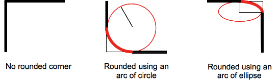

Le modèle de boîte
------------------

Le modèle de mise en page du HTML / CSS repose sur un principe de "boîtes" (en
anglais: box-model).  Le calcul de la taille, des propriétés (couleur,
arrière-plan, forme du cadre) et de la position des boîtes est le rôle du
moteur de rendu. En CSS, chacune de ces boîtes est décrite à partir d'un modèle
standard qui permet de décrire le contenu de l'espace occupé par un élément.

Chaque élément d'un document est matérialisé par une boîte qui peut être
ajustée grâce à des propriétés CSS spécifiques. Ces propriétés peuvent être
représentées ainsi :

<figure>
  
  <figcaption>Modèle de boite en CSS. Par <cite><a href="https://developer.mozilla.org/" target="_blank">Mozilla Developer Network</a></cite></figcaption>
</figure>

La boîte de contenu (content)
: La boîte de contenu à l'endroit où le contenu de l'élément est affiché. Ce
contenu est le texte de l'élément ou les autres boîtes des éléments fils. La
taille de la boîte de contenu est définie avec les propriétés CSS `width` (pour
la largeur) et `height` (pour la hauteur).

La boîte de remplissage (padding)
: La boîte de remplissage représente la marge intérieur d'une boîte. Elle
correspond à la distance entre la boîte de contenu et la bordure. Cette
distance est définie grâce à la propriété `padding`. Cette propriété est en fait
une propriété « raccourcie » pour désigner quatre valeurs : `padding-top`,
`padding-right`, `padding-bottom` et `padding-left` (dans cet ordre).

La bordure (border)
: La bordure d'une boîte est une zone, visible ou non, qui représente la limite
de la boîte. Par défaut, la taille de la bordure vaut 0, ce qui la rend
invisible. La bordure est définie grâce à la propriété CSS `border`. Cette
propriété est aussi une propriété raccourcie composée de `border-width`
(l'épaisseur de la bordure), `border-style` (le style à appliquer pour la ligne
de la bordure, généralement solid) et `border-color` (la couleur). Il est
également possible de définir chaque côté séparément et il existe donc un
ensemble de propriétés `border-*` pour chacun des côtés (`top` pour le haut,
`right` pour la droite, `bottom` pour le bas et `left` pour la gauche).

La marge extérieure (margin)
: La marge (extérieure) représente la distance qui doit séparer deux boîtes. La
marge similaire au remplissage mais se situe à l'extérieur de la bordure. La
propriété raccourcie est `margin` et les propriétés individuelles sont
`margin-top`, `margin-right`, `margin-bottom` et `margin-left`.

Prenons un exemple pour illustrer ces différentes quantités :

```html
<p>Une paragraphe</p>
<p>Une autre paragraphe</p>
```

```css

```

<p>
  <iframe height='200' scrolling='no' src='demos/box-model.html'></iframe>
</p>


Les types de boîte
------------------

Tout ce que nous avons vu jusqu'à présent s'applique aux boîtes qui sont des
blocs. Cependant, il existe d'autres types de boîte en CSS qui se
comportent différemment. Le type de boîte qui s'applique pour un élément est
déterminé par la propriété `display`. CSS fournit de nombreuses valeurs pour
cette propriété. Dans cet article, nous nous concentrerons avant tout sur les
trois valeurs basiques que sont `block`, `inline`, et `inline-block`

Une boîte `block` (ou bloc)
: est définie comme une boîte qui va s'empiler sur d'autres boîtes (autrement
dit, on crée une cassure de la ligne visuelle avant et après la boîte). Le
modèle de boîte vu juste avant s'applique.

Une boîte `inline` (ou en ligne)
: est l'opposée d'une boîte bloc : elle flotte dans le texte du document
(autrement dit, elle ne crée pas de cassure de ligne visuelle avant et après la
boîte et le contenu de cette boîte passera à la ligne selon le contenu qui
l'entoure). Les propriétés du modèle de boîte s'appliquent mais n'impactent pas
les boîtes environnantes.

Une boîte `inline-block` (en bloc et en ligne)
: est quelque chose d'intermédiaire : le contenu flotte dans le document sans
créer de cassure de ligne avant et après. Le contenu reste à l'intérieur de la
boîte et la boîte ne suit pas les règles de saut à la ligne dicté par le
contenu en dehors de la boîte. Enfin les propriétés du modèle de boîte
s'appliquent à ces boîtes et cela impacte les boîtes environnantes.

Pour cacher un élément, on utilise la valeur "none" de la propriété `display`.

Prenons l'exemple suivant :

```html

```

Le fichier `display-types.css` contient :

```css

```

Le rendu du programme HTML est le suivant :

<p>
  <iframe height='500' scrolling='no' src='demos/display-types.html'></iframe>
</p>

Bordure
-------

La bordure supporte de multiples styles à travers la propriété
`border-style` ou comme deuxième argument dans la propriété alias `border`.

<p>
  <iframe height='500' scrolling='no' src='demos/border-styles.html'></iframe>
</p>

La propriété `border-radius` permet de créer des bordures arrondies. Elle
accepte une valeur en pixels qui va correspondre à la valeur du rayon de la
bordure de tout ou de chaque coin.

<figure>
  
  <figcaption>Les bordures arrondis. Par <cite><a href="https://developer.mozilla.org/" target="_blank">Mozilla Developer Network</a></cite></figcaption>
</figure>

Prenons l'exemple suivant :

```html

```

```css

```

<p>
  <iframe height='280' scrolling='no' src='demos/border-radius.html'></iframe>
</p>


Couleur et image de fond
------------------------

Le fond d'un élément HTML est géré à travers les propriétés `backgroud-*` ou
leurs propriété alias `backgroud` :

- `background-color` : Gérer la couleur du fond. Il accepte les même valeurs
  acceptées par la propriété `color`. La valeur `transparent` permet de rendre
  le fond transparent.
```css
.a {
    background-color: red;
}
.b {
    background-color: #f0d;
}
.c {
    background-color: rgba(255, 200, 0, 0.5);
}
```
- `background-image`: Gérer l'image de fond. Elle accepte comme valeur l'URL de
  l'image passé à la fonction `url()`. La propriété peut accepter de multiples
  images séparées par virgule.
```css
.a {
    background-image: url(images/mon-image.png);
}
```
On peut gérer l'image du fond avec les propriétés ci-dessous.
- `background-position` : Positionner l'image relativement à son élément. La
  valeur accepte deux arguments pour exprimer la position verticalement et
  horizontalement. L'argument peut être exprimé en `%` ou en mot clés : "top",
  "left", "right", "bottom", "center" ou en pixels.
- `background-repeat` : Gérer comment l'image sera répéter. Pour se répéter en
  axe vertical, on utilise la valeur "repeat-x". Pour se répéter en axe
  horizontal, on utilise la valeur "repeat-y". Pour se répéter dans les deux
  axes, on utilise la valeur "repeat" qui est la valeur par défaut. Pour ne pas
  se répéter, on utilise la valeur "no-repeat".
- `background-size` : Gérer la taille de l'image. La valeur peut être exprimée
  en % pour dimensionner l'image par rapport à la taille de l'élément auquel
  elle est appliquée, ou en pixels ou en utilisant les mots clés "cover" et
  "contain".
- `background-attachment` : Pour choisir de fixer l'image de fond ou de la faire
  défiler en même temps que l'utilisateur va descendre dans la page. Cette
  propriété accepte deux valeurs : "fixed" (pour fixer le fond) et "scroll"
  (valeur par défaut).

Prenons l'exemple suivant :

```html

```

```css

```

<p>
  <iframe height='120' scrolling='yes' src='demos/background-image.html'></iframe>
</p>
